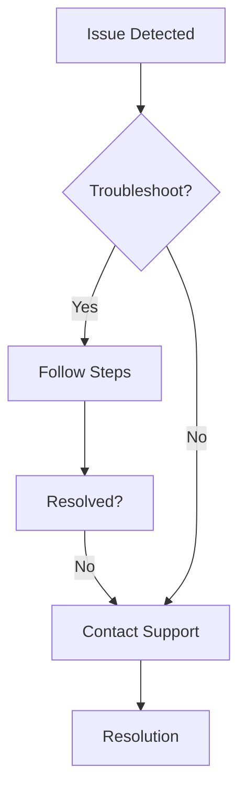

## Account and Access

Lexcetera Literacy Lab provides secure access for adult learners and educators to career skills and multiliteracy content. Use these solutions for common account issues.

<ExpandableGroup>

<Expandable title="How do I reset my password?">

Follow these steps to regain access:

<Steps>
  <Step title="Request Reset" icon="key">
    Visit `https://app.lexcetera.com/forgot-password` and enter your email address.
  </Step>
  <Step title="Check Email" icon="mail">
    Look for a reset link in your inbox (check spam folder too).
  </Step>
  <Step title="Set New Password" icon="check-circle">
    Click the link and create a strong password (at least 12 characters with symbols).
  </Step>
</Steps>

<Callout kind="tip">
  Enable two-factor authentication after resetting for added security.
</Callout>

</Expandable>

<Expandable title="What if I can't log in with valid credentials?">
Clear your browser cache and cookies, then try again. Supported browsers include recent versions of Chrome, Firefox, and Safari.

<Tabs>
  <Tab title="Chrome" icon="chrome">
    Press `Ctrl+Shift+Delete` (Windows) or `Cmd+Shift+Delete` (macOS), select "All time" for cookies, and clear.
  </Tab>
  <Tab title="Firefox" icon="firefox">
    Go to Settings > Privacy & Security > Cookies and Site Data > Clear Data.
  </Tab>
  <Tab title="Safari" icon="apple">
    Develop > Empty Caches, then Settings > Privacy > Manage Website Data > Remove All.
  </Tab>
</Tabs>

If issues persist, contact support at `support@lexcetera.com`.
</Expandable>

</ExpandableGroup>

## Learning Content Queries

Explore multiliteracy modules designed for 21st-century career skills.

<Columns cols={2}>
  <Card title="Content Access" icon="book-open" href="/docs/content-guide">
    Browse 500+ interactive lessons on digital literacy and professional development.
  </Card>
  <Card title="Progress Tracking" icon="trending-up" href="/docs/progress">
    Monitor learner advancement with detailed analytics dashboards.
  </Card>
</Columns>

<Expandable title="How do I assign content to learners?">
As an educator, use the dashboard:

1. Navigate to Classes > Assign Modules.
2. Select learners and choose from literacy labs (e.g., "Career Resume Builder").
3. Set deadlines and track completion.

For API integration:

<CodeGroup tabs="JavaScript,Python">
  ```javascript
  const response = await fetch('https://api.lexcetera.com/v1/assign', {
    method: 'POST',
    headers: { 'Authorization': 'Bearer YOUR_API_KEY' },
    body: JSON.stringify({
      learnerIds: ['user123', 'user456'],
      moduleId: 'resume-builder-101'
    })
  });
  ```
  ```python
  import requests
  response = requests.post(
    'https://api.lexcetera.com/v1/assign',
    headers={'Authorization': 'Bearer YOUR_API_KEY'},
    json={'learnerIds': ['user123', 'user456'], 'moduleId': 'resume-builder-101'}
  )
  ```
</CodeGroup>

</Expandable>

## Technical Troubleshooting

Resolve common issues quickly.

<Expandable title="Browser Console Errors">
Open developer tools (`F12`) and check for errors like network failures.

<Callout kind="alert">
  Ensure your internet speed is `<5ms` latency for smooth video playback.
</Callout>

Common fix:

````jsx
<CodeGroup tabs="JavaScript Debugging">
```javascript
// Paste in console to test API connectivity
fetch('https://api.lexcetera.com/health')
  .then(res => res.json())
  .then(console.log)
  .catch(console.error);
```
</CodeGroup>
````

</Expandable>

<Expandable title="Mobile App Issues" default-open="false">
Restart the app and verify OS compatibility (iOS 15+, Android 11+). Update via App Store or Google Play.

</Expandable>

## Need More Help?

<Callout kind="info">
  Reach our support team at `support@lexcetera.com` or join the community forum for peer assistance.
</Callout>



These FAQs cover most scenarios. Update your browser and clear cache regularly for optimal performance.