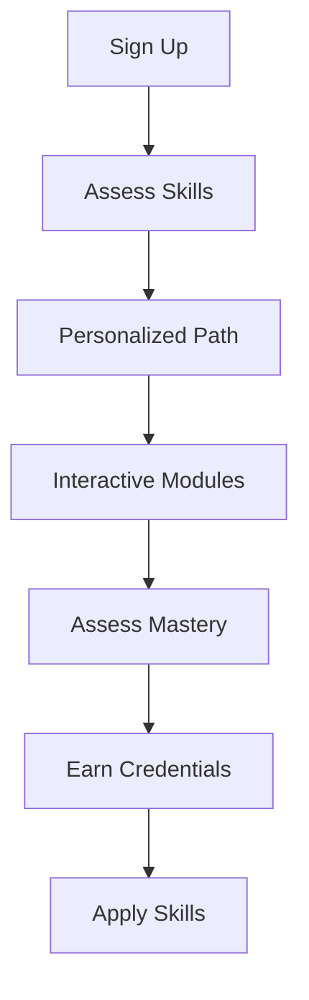

## Platform Overview

Lexcetera Literacy Lab empowers adult learners with interactive tools for career advancement and multiliteracy skills. You build essential competencies in digital communication, critical thinking, and professional development through adaptive learning paths. The platform combines AI-driven personalization with collaborative features to support lifelong learning.

<Columns cols={3}>
  <Card title="Adaptive Learning" icon="book-open" href="/docs/learning-paths">
    Personalized modules adjust to your pace and goals, ensuring mastery before progression.
  </Card>
  <Card title="Career Skills" icon="award" href="/docs/skills">
    Focus on real-world abilities like resume building, interview prep, and workplace communication.
  </Card>
  <Card title="Multiliteracy Hub" icon="users" href="/docs/multiliteracy">
    Develop skills across text, media, data, and tech literacies for the 21st century.
  </Card>
</Columns>

## Key Benefits for Adult Learners

You gain flexible access to bite-sized lessons optimized for busy schedules. Track progress with detailed analytics and earn verifiable credentials for job applications. The platform fosters community through forums and peer reviews.

<Callout kind="success">
  Over 10,000 learners have upskilled, with 85% reporting career improvements within six months.
</Callout>

## Target Audience and Use Cases

Lexcetera serves working professionals, career changers, and lifelong learners. Explore tailored applications below.

<Tabs>
  <Tab title="Professionals" icon="briefcase">
    Upskill for promotions with modules on leadership and digital tools.
    
    ```javascript
    // Embed a career module in your LMS
    const embedCareerModule = (userId) => {
      const iframe = document.createElement('iframe');
      iframe.src = `https://api.lexcetera.com/embed/career?user=${userId}`;
      document.body.appendChild(iframe);
    };
    ```
  </Tab>
  <Tab title="Career Changers" icon="refresh-cw">
    Transition fields with targeted skill bridges like tech basics and soft skills.
    
    <Image
      src="https://images.unsplash.com/photo-1522071820081-009f0129c71c?ixlib=rb-4.0.3&auto=format&fit=crop&w=800&q=80"
      alt="Adult learner at computer mastering new skills"
      width="800"
      height="500"
    />
  </Tab>
  <Tab title="Educators" icon="chalkboard">
    Integrate into classrooms for adult ed programs with admin dashboards.
    
    ```python
    # Fetch learner progress via API
    import requests
    response = requests.get(
      'https://api.lexcetera.com/v1/progress',
      headers={'Authorization': 'Bearer YOUR_API_KEY'}
    )
    print(response.json())
    ```
  </Tab>
</Tabs>

## Get Started in Minutes

Follow these steps to launch your learning journey.

<Steps>
  <Step title="Sign Up" icon="user-plus">
    Create a free account at [app.lexcetera.com](https://app.lexcetera.com).
  </Step>
  <Step title="Choose Path" icon="map">
    Select from career, multiliteracy, or custom tracks.
  </Step>
  <Step title="Start Learning" icon="play-circle">
    Dive into your first interactive module.
  </Step>
</Steps>

<ExpandableGroup>
  <Expandable title="Frequently Asked Questions" default-open="true">
    ### What devices work best?
    
    Access via desktop, tablet, or mobile browsers for optimal experience.
    
    ### How do credentials work?
    
    Earn badges shareable on LinkedIn or resumes upon module completion.
    
    ```javascript highlight="2-4"
    // Verify badge via API
    const verifyBadge = async (learnerId, badgeId) => {
      const res = await fetch(`/api/badges/${learnerId}/${badgeId}`);
      return res.ok ? 'Verified' : 'Pending';
    };
    ```
  </Expandable>
</ExpandableGroup>

## Learning Flow



<Callout kind="tip">
  Customize your dashboard with `{userPreferences}` to match your goals.
</Callout>