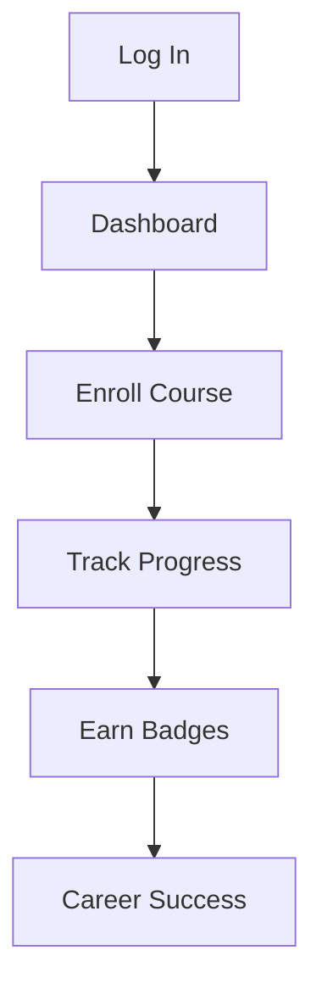

## Overview

Welcome to the Literacy Lab platform, your gateway to adult education, career skills mastery, and 21st-century multiliteracy development. You access a personalized dashboard that centralizes your learning journey. This guide walks you through dashboard navigation, course enrollment, and progress tracking to maximize your skill-building experience.

<Columns cols={3}>
  <Card title="Dashboard" icon="layout" href="#dashboard-navigation">
    View your personalized learning hub.
  </Card>
  <Card title="Enroll in Courses" icon="book-open" href="#enrolling-in-courses">
    Discover and join career-focused programs.
  </Card>
  <Card title="Track Progress" icon="trending-up" href="#tracking-progress">
    Monitor assessments and achievements.
  </Card>
</Columns>

## Dashboard Navigation

Your dashboard provides an at-a-glance view of active courses, upcoming assessments, and recommended content tailored to career skills like digital literacy and resume building.

<Steps>
  <Step title="Log In" icon="log-in">
    Enter your credentials at `https://app.lexcetera.com/login`. Use your registered email and password.
  </Step>
  <Step title="Access Dashboard" icon="home">
    Click the **Dashboard** icon in the top-left navigation bar. It displays widgets for **My Courses**, **Progress Overview**, and **Recommendations**.
  </Step>
  <Step title="Customize Layout" icon="settings">
    Drag and drop widgets to rearrange them. Click the gear icon to toggle notifications for new multiliteracy modules.
  </Step>
</Steps>

<Callout kind="tip">
  Pin frequently used courses to the top of your dashboard for quicker access during your daily learning routine.
</Callout>

## Enrolling in Courses

Browse and enroll in courses designed for adult learners, covering topics from foundational literacy to advanced career competencies.

<Tabs>
  <Tab title="Web Browser" icon="globe">
    <Steps>
      <Step title="Search Courses">
        Use the search bar: type `"Digital Literacy Fundamentals"` or `"Career Skills: Resume Mastery"`.
      </Step>
      <Step title="Enroll">
        Click **Enroll Now** on the course card. Confirm prerequisites if prompted.
      </Step>
    </Steps>
  </Tab>
  <Tab title="Mobile App" icon="smartphone">
    Open the Literacy Lab app, navigate to **Discover**, and tap **Join Course**. Syncs automatically with your web progress.
  </Tab>
</Tabs>

## Tracking Progress and Assessments

Monitor your advancement through interactive assessments and skill badges. The platform uses a progress bar system where you earn points for completing modules.

### Progress Overview Table

| Section          | Completion | Assessments Passed | Next Milestone      |
|------------------|------------|--------------------|---------------------|
| Digital Literacy | 75%       | 3/5               | Module 4 Quiz      |
| Resume Building  | 40%       | 1/3               | Video Assignment   |
| Multiliteracy    | 100%      | 4/4               | Advanced Badge     |

<Expandable title="Advanced Tracking Tips" default-open="false">

To export your progress data:

<CodeGroup tabs="JavaScript,cURL">
```javascript
// Fetch progress via platform API
const response = await fetch('https://api.lexcetera.com/v1/progress', {
  headers: { 'Authorization': 'Bearer YOUR_TOKEN' }
});
const data = await response.json();
console.log(data.courses);
```
```bash
curl -H "Authorization: Bearer YOUR_TOKEN" \
     https://api.lexcetera.com/v1/progress
```
</CodeGroup>

Review detailed analytics in the **Reports** tab, including time spent and skill gaps.

</Expandable>

<Callout kind="success">
  Completing assessments unlocks shareable badges for your LinkedIn profile or resume.
</Callout>

## Next Steps

Explore recommendations on your dashboard to continue building 21st-century skills. For support, visit the **Help Center** or contact `support@lexcetera.com`.

